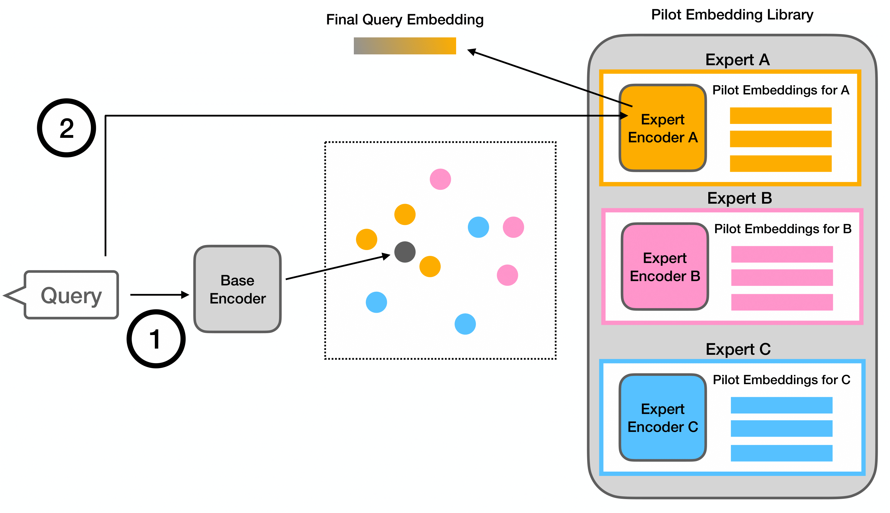

# RouterRetriever: Routing over a Mixture of Expert Embedding Models 

[AAAI 2025] This is the official repository for [RouterRetriever: Routing over a Mixture of Expert Embedding Models](https://arxiv.org/abs/2409.02685). 

RouterRetriever is a retrieval model that leverages *multiple* domain-specific experts along with a routing mechanism to select the most appropriate expert for each query. It is lightweight and allows easy addition or removal of experts without additional training. Its consistent high performance compared to single-embedding models highlights the advantages of integrating domain-specific expertise for retrieval tasks.




### Requirements
```
pip install -r requirements.txt
```

### Data
* Download datasets from the [BEIR benchmark](https://huggingface.co/BeIR). For those with missing training datasets, we used the generated queries (e.g., [scidocs](https://huggingface.co/datasets/BeIR/scidocs-generated-queries)).
* Download and Save them under `beir_datasets`.
* Preprocess dataset:
  ```
  python preprocess.py --datasets msmarco/quora/arguana/hotpotqa/nfcorpus/scifact/fiqa --beir_dir beir_datasets --save_dir beir_datasets
  ```

### Training
```
python train.py --config config/*.json
```

### Building Pilot Embedding Library
* for each instance in the dataset, get a score
```
python get_scores.py --dataset scifact --save_dir outputs/all_score.json --gatenames msmarco/quora/arguana/hotpotqa/nfcorpus/scifact/fiqa
```
* get pilot embedding by grouping them by the best performing expert and extracting centroid embedding
```
python get_pilot_embeddings.py --datasets msmarco/quora/arguana/hotpotqa/nfcorpus/scifact/fiqa --score_path outputs/all_score.json --beir_dir beir_datasets --save_dir outputs/pilot_embs.json
```

### Inference
* Based on constructed pilot embeddings, the model routes the query to the appropriate domain-specific expert and get the score. 
```
python test.py --pilot_embs_path outputs/pilot_embs.json --datasets msmarco/quora/arguana/hotpotqa/nfcorpus/scifact/fiqa --beir_dir beir_datasets --save_dir outputs/score.json
```

### Resources
Model checkpoints and files will be uploaded to [huggingface](https://huggingface.co/amy-hyunji-lee/routerretriever)

### Contact
Please leave Github issues or contact Hyunji Lee `hyunji.amy.lee@kaist.ac.kr` for any questions

### Citation
If you find RouterRetriever useful, please cite our paper:
```
@article{Lee2024RouterRetrieverET,
  title={RouterRetriever: Routing over a Mixture of Expert Embedding Models},
  author={Hyunji Lee and Luca Soldaini and Arman Cohan and Minjoon Seo and Kyle Lo},
  journal={AAAI},
  year={2025},
  url={https://api.semanticscholar.org/CorpusID:272398087}
}
```
This project builds upon and credits the following resources: 
1. [Contriever](https://github.com/facebookresearch/contriever): the base model utilized in the project. 
2. [BEIR](https://github.com/beir-cellar/beir): experiments were conducted using the BEIR benchmark.
3. [A Simple Recipe for Improving Out-of-Domain Retrieval in Dense Encoders](https://github.com/amy-hyunji/lora-for-retrieval): codebase for training LoRA.
Please ensure proper credit and citation if you use this codebase in your own projects.
